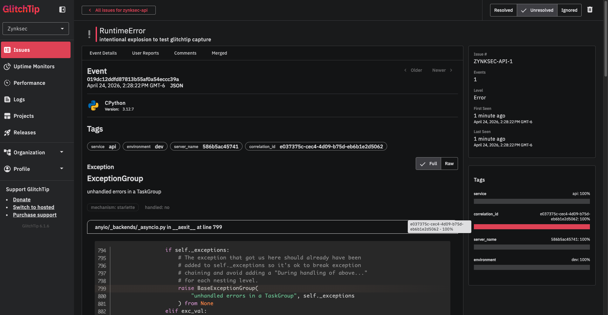

# Zynksec

> **Status: pre-alpha. Building in public. Not usable yet — do not point this at anything you care about.**

Zynksec is an open-source security platform for modern SaaS applications. The goal is to take the vulnerability-detection capabilities that today are locked inside expensive commercial tools and rebuild them as a DevSecOps-friendly platform anyone can self-host.

## What Zynksec is

Zynksec is a **DAST-first** (Dynamic Application Security Testing) platform: it tests running web apps and APIs from the outside, the way a real attacker would, and reports the issues it finds with evidence, remediation guidance, and a priority score you can actually trust.

Under the hood, Zynksec orchestrates best-in-class open-source scanners — [OWASP ZAP](https://www.zaproxy.org/) as the core DAST engine, [ProjectDiscovery](https://projectdiscovery.io/) tools for recon, [Nuclei](https://nuclei.projectdiscovery.io/) for templated checks, [Interactsh](https://github.com/projectdiscovery/interactsh) for out-of-band detection, and more.

The differentiation lives above the scanners:

- **Unified finding schema** so different engines speak one language.
- **Noise reduction and correlation** so you don't get 400 duplicates from three scanners finding the same bug.
- **Plain-language remediation** tied to what the tool actually observed, not a generic CWE pamphlet.
- **Framework-aware scanning** — the first profile is Next.js + Vercel, a reality modern "vibe-coded" SaaS lives in.
- **Ownership verification** before any active scan, so the project cannot be weaponized against third parties.

Later phases add SAST, secret scanning, dependency / SBOM analysis, runtime protection, and an AI-assisted remediation and triage layer (self-hosted, open-weight models first).

## Why this exists

Modern SaaS is built faster than ever — Next.js + Vercel + Supabase + Clerk + Stripe can turn a weekend idea into production in hours. That speed usually outruns security. The commercial tools that address this cost tens of thousands of dollars per year and are built for large enterprises, not indie builders or early-stage teams.

Zynksec is the tool a solo founder, a small team, or a security-curious developer should be able to reach for on day one — free, self-hostable, and aimed at the security mistakes modern stacks actually make.

## Quick start

Zynksec runs locally via Docker Compose. Three named startup modes
cover the common workflows:

### Lean dev (default)

```bash
git clone https://github.com/ZynkSec/zynksec.git
cd zynksec
cp .env.example .env
docker compose up -d --build
```

Brings up the core stack: api (port 8000), worker, postgres, redis.
No scanning, no error tracking, no lab target. Enough to poke at
`GET /api/v1/health`, `GET /api/v1/ready`, and run unit tests.

### Lab scan

```bash
docker compose --profile lab up -d --build
docker compose exec api alembic -c apps/api/alembic.ini upgrade head
```

Adds `zap` and `juice-shop` on isolated Docker networks. Run a real
passive scan against the intentionally-vulnerable
[OWASP Juice Shop](https://owasp.org/www-project-juice-shop/) target:

```bash
# POST a scan (scan_profile is optional; default is PASSIVE)
curl -X POST http://localhost:8000/api/v1/scans \
  -H 'content-type: application/json' \
  -d '{"target_url":"http://juice-shop:3000/","scan_profile":"PASSIVE"}'
# -> {"id":"3f16096a-...","status":"queued","scan_profile":"PASSIVE","findings":[]}

# Poll until complete (passive scan runs in ~15–30 s)
curl http://localhost:8000/api/v1/scans/3f16096a-8c1e-4721-b387-39652e9304bd
```

The `scan_profile` field is optional and defaults to `PASSIVE`.
Available profiles:

- **`PASSIVE`** — spider + passive analysis only. No requests beyond
  what a normal browser would issue. ~15-30 s on juice-shop, ~327
  findings on this lab. Safe against any target (no payload injection).
- **`SAFE_ACTIVE`** _(Phase 1 Sprint 2)_ — spider + passive + a
  constrained active scan with the `zynksec_safe` policy: attack
  strength capped at MEDIUM, single thread per host, 100 ms per-request
  delay, time-based SQLi/XPath/XSLT/SSTI/XXE/buffer-overflow scanners
  disabled (full list in
  [`SAFE_ACTIVE_DISABLED_SCANNERS`](packages/scanners/src/zynksec_scanners/zap/plugin.py)).
  ~5-8 minutes on juice-shop. **Use only against staging/dev
  environments or production targets you own** — the active scan still
  fires injection payloads. Phase 1 Sprint 4 will add ownership
  verification (DNS TXT / well-known file) so this is enforced at the
  API layer rather than left to the operator.
- **`AGGRESSIVE`** — reserved on the OpenAPI spec; the API still
  returns `422 scan_profile_not_implemented` pointing at Phase 1
  Sprint 3.

Scan duration scales with the target's parameter surface. A small
subpath (e.g. `/rest/products/search?q=apple`) finishes in minutes;
a full app like OWASP Juice Shop can take 20+ minutes at MEDIUM
strength. Plan accordingly when integrating into CI — the SAFE_ACTIVE
integration test scans a single juice-shop subpath on purpose, and
full-target verification is recommended as a manual pre-tag gate
rather than a per-PR check.

Multi-target scanning is deferred to Phase 2.

A complete scan response (trimmed to three of the 327 findings on
this run) looks like:

```json
{
  "id": "3f16096a-8c1e-4721-b387-39652e9304bd",
  "target_url": "http://juice-shop:3000/",
  "scan_profile": "PASSIVE",
  "status": "completed",
  "started_at": "2026-04-24T18:09:39.777024Z",
  "completed_at": "2026-04-24T18:10:00.620279Z",
  "findings": [
    {
      "taxonomy": { "zynksec_id": "ZYN-DAST-CSP_MISSING-10038", "cwe": 693 },
      "severity": { "level": "medium", "confidence": "high" },
      "location": { "url": "http://juice-shop:3000/", "method": "GET" }
    },
    {
      "taxonomy": { "zynksec_id": "ZYN-DAST-COOKIE_HTTPONLY-10010", "cwe": 1004 },
      "severity": { "level": "low", "confidence": "medium" },
      "location": { "url": "http://juice-shop:3000/rest/user/whoami", "method": "GET" }
    },
    {
      "taxonomy": { "zynksec_id": "ZYN-DAST-SRI_MISSING-90003", "cwe": 345 },
      "severity": { "level": "medium", "confidence": "high" },
      "location": { "url": "http://juice-shop:3000/", "method": "GET" }
    }
  ]
}
```

This mode is what the integration tests run under.

### Full observability

```bash
docker compose --profile lab --profile obs up -d --build
```

Adds the four-container GlitchTip stack (web, worker, postgres,
redis) on top of the lab scan stack. Use this when you need error
capture working — normal coding doesn't.

## Set up error tracking

GlitchTip is **opt-in**. Bring it up with `--profile obs` only when
you need error capture — running it always costs ~300 MiB of RAM for
no benefit during normal coding.

First-run setup is manual (GlitchTip is a Django app; the
superuser + project + DSN flow is the same as Sentry):

1. Start the `obs` profile (see above).
2. Create a superuser:

   ```bash
   docker compose exec glitchtip-web ./manage.py createsuperuser
   ```

3. Open GlitchTip at <http://localhost:8001>, log in, create an
   organization, create a project, and copy the project DSN from
   the project's SDK Keys page.
4. Paste the DSN into `.env`:

   ```env
   SENTRY_DSN=http://<key>@localhost:8001/<project-id>
   ```

5. Restart the api + worker so they pick up the DSN:

   ```bash
   docker compose up -d --force-recreate api worker
   ```

6. Trigger a deliberate test exception (any handler that raises will
   do). The event appears in GlitchTip with the request's
   `correlation_id` attached as a tag.



> **TODO(hugo):** screenshot placeholder — the image above won't
> render until `docs/screenshots/glitchtip-capture.png` is pasted in.
> The agent that produced this PR is headless and couldn't capture
> it directly.

When `SENTRY_DSN` is empty (the default in `.env.example`), the
Sentry SDK initialises as a no-op — api + worker boot identically,
no warnings, no retries against a missing collector.

## Current status

| Phase                               | Scope                                                                                           | State       |
| ----------------------------------- | ----------------------------------------------------------------------------------------------- | ----------- |
| Phase 0 — Foundation                | Monorepo layout, Docker Compose, minimal ZAP baseline scan against a local target               | In progress |
| Phase 1 — DAST MVP                  | ZAP orchestration, Nuclei integration, unified finding schema, basic UI, ownership verification | Planned     |
| Phase 2 — Recon + APIs              | Subfinder/httpx/Katana discovery, OpenAPI/GraphQL testing, OAST via Interactsh                  | Planned     |
| Phase 3 — SAST / secrets / deps     | Semgrep, Gitleaks, Trivy, OSV-Scanner, Syft, Grype                                              | Planned     |
| Phase 4 — AI-assisted remediation   | Self-hosted open-weight models (Mistral Small 3.1, Qwen3 class)                                 | Planned     |
| Phase 5 — Hosted scan orchestration | Single-VPS deployment, multi-tenant hosted option                                               | Planned     |
| Phase 6 — Active defense            | Coraza/ModSecurity + CRS, Falco for runtime                                                     | Planned     |
| Phase 7 — Commercial viability      | Pro rule packs, hosted SaaS, enterprise features                                                | Planned     |

Detailed scoping and roadmap lives in [`docs/01_scoping_and_roadmap.md`](docs/01_scoping_and_roadmap.md).

## Architecture at a glance

- **Backend:** Python 3.12, FastAPI, Celery, Redis, PostgreSQL.
- **Frontend:** Next.js, Tailwind, shadcn/ui, Auth.js + GitHub OAuth.
- **Scanners:** containerized workers (OWASP ZAP, Nuclei, ProjectDiscovery suite, etc.).
- **Observability:** structlog JSON logs with a `correlation_id` that threads api → Celery task → worker → scanner; self-hosted GlitchTip for error capture (opt-in via `obs` profile); `/api/v1/ready` probe distinguishes liveness from readiness.
- **Deployment:** Docker Compose for local dev, single cheap VPS for Phase 5, Kubernetes only when there's a reason.
- **Schema:** Alembic migrations over a custom PostgreSQL schema — not DefectDojo.

### Network isolation

Zynksec uses three Docker Compose networks. Each service joins only
the networks it legitimately needs, and the scan-target network is
`internal: true` — containers on it cannot reach the host or the
public internet, which keeps an accidental or compromised scanner
from using our stack as a traffic source:

- `zynksec-core` — api, worker, postgres, redis, mailpit, GlitchTip.
- `zynksec-scan` — worker and zap only. Worker drives ZAP's REST API.
- `zynksec-targets` — zap and lab targets only. `internal: true`; the worker never joins this network, so it reaches the target only via ZAP.

Full architecture in [`docs/03_architecture.md`](docs/03_architecture.md).

## How to follow along

Zynksec is not ready for use or contribution yet. If you're curious:

- **Star the repo** to get notified when things start shipping.
- **Watch → Custom → Releases** to get pinged on the first usable release.
- **Discussions** are open for ideas, use cases, and questions.
- **Issues** are for bugs and scoped work once Phase 0 lands; please don't file implementation requests yet.

## Documentation

| Doc                                                                                          | What it covers                                                     |
| -------------------------------------------------------------------------------------------- | ------------------------------------------------------------------ |
| [`docs/01_scoping_and_roadmap.md`](docs/01_scoping_and_roadmap.md)                           | Product scope, phases, deployment topology, risk mitigation        |
| [`docs/02_product_strength_and_foundations.md`](docs/02_product_strength_and_foundations.md) | Modern SaaS reality, expanded vulnerability taxonomy, design moves |
| [`docs/03_architecture.md`](docs/03_architecture.md)                                         | System architecture, schemas, plugin contract, state machine       |

## Security

Please don't file security issues as public issues. See [`SECURITY.md`](SECURITY.md) for how to report vulnerabilities.

## Contributing

Please read [`CONTRIBUTING.md`](CONTRIBUTING.md) first. Short version: Zynksec isn't ready for code contributions yet; the most helpful thing right now is to open a Discussion about the SaaS stack or vulnerability class you'd want Zynksec to handle best.

## License

Zynksec is licensed under the **GNU Affero General Public License v3.0**. See [`LICENSE`](LICENSE).

AGPLv3 was chosen deliberately: if someone runs a modified version of Zynksec as a hosted service, they must release their modifications under the same license. This keeps the open-source project durable against commercial forks that would otherwise absorb community work without giving anything back.

## Acknowledgements

Zynksec stands on the shoulders of OWASP ZAP, ProjectDiscovery, Semgrep, Trivy, OSV-Scanner, Coraza, Falco, and many others. Those projects are the reason this is possible at all.
